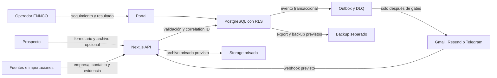

# Inventario de tratamiento de datos

Snapshot: 11 de agosto de 2026, America/Mexico_City.

Estado del documento: `EVIDENCE_READY` para arquitectura local. No constituye dictamen legal ni autoriza datos reales, proveedores, producción o transferencias.

## Estados de evidencia

- `VERIFIED`: existe evidencia local inspeccionable en código, migración, contrato o prueba.
- `UNKNOWN`: no existe evidencia suficiente para afirmar el dato.
- `BLOCKED_EXTERNAL`: requiere decisión, documento, cuenta, compra o revisión externa expresamente autorizada.

## Roles

### Roles operativos verificados

La migración define `ennco_admin`, `ennco_operator`, `teckel_admin`, `teckel_operator` y `auditor_readonly`. Todas las tablas sensibles incorporan `organization_id` y RLS. La suite PostgreSQL local probó aislamiento entre organizaciones y rechazo de referencias cruzadas.

### Roles legales no cerrados

| Pregunta | Estado | Tratamiento actual |
|---|---|---|
| Responsable y encargado bajo la ley aplicable | UNKNOWN | No asignar etiquetas legales hasta revisión |
| Fundamento jurídico por finalidad | UNKNOWN | Captura y outreach reales bloqueados |
| Aviso de privacidad final | BLOCKED_EXTERNAL | Requiere revisión y aprobación antes de publicación |
| DPA por proveedor | BLOCKED_EXTERNAL | Ningún proveedor puede recibir datos reales sin documento revisado |
| Transferencias y subencargados | UNKNOWN | Región, subprocesadores y mecanismo de transferencia pendientes |
| Responsable de privacidad de ENNCO | BLOCKED_EXTERNAL | Debe ser designado por ENNCO |

## Titulares y categorías

- Usuarios de ENNCO y Teckel con acceso al portal.
- Contactos de empresas investigadas.
- Prospectos que completen una precotización o respondan a una campaña.
- Contactos de clientes y prospectos actuales incluidos en supresión.
- Participantes de reuniones y oportunidades comerciales.

Categorías previstas:

- Identidad y acceso: identificador de usuario, organización, rol y estado de acceso.
- Identificación profesional: nombre, cargo, empresa, correo y teléfono laboral.
- Evidencia de investigación: fuente, URL, fecha, confianza y checksum.
- Datos energéticos: gasto, tarifa, capacidad, ubicación y recibo CFE opcional.
- Comunicaciones: asunto, cuerpo, dirección, respuesta, rebote, baja y metadatos de entrega.
- Verdad comercial: lead, evidencia de calificación, reunión, oportunidad, propuesta, cierre, pago, atribución y comisión.
- Gobierno y seguridad: aprobación, incidente, tarea, audit log, outbox y dead letter.

## Inventario por proceso

| ID | Proceso y finalidad operativa | Datos y tablas | Origen | Destino o proveedor | Acceso | Estado | Evidencia y condición |
|---|---|---|---|---|---|---|---|
| DPI-01 | Identidad, acceso y autorización | `organizations`, `organization_users`, roles | Administrador ENNCO | PostgreSQL y Auth previsto | Admin y miembro de la organización | VERIFIED para código y política local, BLOCKED_EXTERNAL para Auth real | `src/lib/auth`, `src/lib/supabase`; proveedor no creado |
| DPI-02 | Importar y depurar investigación industrial | `import_batches`, `accounts`, `account_aliases`, `contacts`, `source_evidence` | Archivos ENNCO, fuentes públicas y Apollo previsto | PostgreSQL | Operadores y auditor | VERIFIED para esquema e importación local, BLOCKED_EXTERNAL para Apollo | Migración líneas 46 a 124; `npm run verify:data` con 28 controles PASS |
| DPI-03 | Evitar contacto prohibido o duplicado | `suppression_entries` con empresa, correo, dominio, tipo y razón | Anexo A, clientes actuales, baja, rebote y DNC | PostgreSQL y gate transaccional de envío | Admin, operador y worker técnico | VERIFIED para snapshot local, BLOCKED_EXTERNAL para binding e importación | Migración líneas 126 a 146, función `app.is_suppressed` y snapshot `8e986eff...`; cero registros elegibles |
| DPI-04 | Captar una solicitud y calcular precotización | `prequote_models`, `prequotes` | Formulario público | PostgreSQL | Prospecto crea; operadores leen por RLS | VERIFIED para contrato de datos, BLOCKED_EXTERNAL para uso live | Migración líneas 148 a 188; aplicación actual usa `synthetic_demo` |
| DPI-05 | Recibir y conservar temporalmente recibo o PDF | `prequote_documents`, ruta privada, checksum, tipo, tamaño y `retention_until` | Prospecto | Storage privado previsto | Operador autorizado después de escaneo | VERIFIED con stubs locales, BLOCKED_EXTERNAL para Storage real | Migración 002; magic bytes y cuarentena probados; antivirus real pendiente |
| DPI-06 | Preparar y ejecutar outreach | campañas, secuencias, buzones, enrollments y `messages` | Investigación aprobada y manifest | Gmail API prevista | Revenue Operations y worker | VERIFIED para esquema y dry run, BLOCKED_EXTERNAL para envío | Migración líneas 204 a 315; kill switch y envío real deshabilitados |
| DPI-07 | Recibir respuesta, rebote o baja | `provider_events`, `messages`, `suppression_entries` | Gmail y Pub/Sub previstos | PostgreSQL | Worker y operadores | VERIFIED para idempotencia de evento, BLOCKED_EXTERNAL para integración real | Migración líneas 318 a 329; cuentas Google no creadas |
| DPI-08 | Calificar y operar pipeline | `leads`, `qualification_checks`, `opportunities`, `meetings`, `proposals`, `payments` | Respuesta, reunión y operador | PostgreSQL y portal | ENNCO y Teckel según rol | VERIFIED para esquema y golden path sintético | Migración líneas 332 a 413; cero datos comerciales reales |
| DPI-09 | Probar atribución y comisión | `attribution_events`, `commissions` | Primer contacto y primer pago verificados | PostgreSQL y reporte | Admin, operador y auditor | VERIFIED para esquema, UNKNOWN para procedimiento live | Migración líneas 415 a 438; ventana contractual de 12 meses |
| DPI-10 | Asistente acotado en propuestas | Mensaje del usuario y contexto permitido | Visitante de propuesta | Proveedor de modelo por seleccionar | Usuario y servicio | VERIFIED como fail closed, BLOCKED_EXTERNAL para proveedor y procesamiento live | Endpoint actual responde `503`; DPA, región y retención del proveedor UNKNOWN |
| DPI-11 | Alertar y recuperarse de fallas | `event_outbox`, `notification_deliveries`, `dead_letters`, `incidents`, `tasks` | Sistema y operadores | Portal, Resend y Telegram previstos | Equipo técnico y cliente según severidad | VERIFIED para esquema local, BLOCKED_EXTERNAL para canales | Migración líneas 493 a 580; proveedores sin cuenta ENNCO verificada |
| DPI-12 | Trazabilidad, aprobación y aceptación | roadmap, gates, evidencias, aprobaciones y `audit_log` | Sistema y usuarios | PostgreSQL y portal | Miembros y auditor | VERIFIED para integridad y minimización local | Migración 002 usa allowlist y sanea snapshots; staging real pendiente |
| DPI-13 | Errores, trazas y pruebas sintéticas | Error, latencia, correlation ID y health | Aplicación | Sentry y Checkly previstos | Equipo técnico | BLOCKED_EXTERNAL | No hay proveedor creado, región ni DPA; PII está prohibida por política |
| DPI-14 | Backup, exportación y restore | base, objetos y manifiestos de backup | PostgreSQL y Storage | Copia cifrada fuera del proveedor | Admin técnico limitado | VERIFIED local sintético, BLOCKED_EXTERNAL para producción | Restore separado local pasa; PITR, Storage real, región y llaves pendientes |
| DPI-15 | Retención, legal hold y borrado controlado | `legal_holds`, `deletion_batches`, `deletion_items`, `deletion_tombstones` | Política, solicitud validada o evento de vencimiento | PostgreSQL y Storage dentro de una transacción | Dos administradores humanos y worker técnico | VERIFIED local sintético, BLOCKED_EXTERNAL para producción | Migración 003; cuatro ojos, hold, anonimización, tombstone y rollback irreversible pasan en PG16 local |

## Flujo de datos

Los nodos de proveedor y backup son arquitectura objetivo. Permanecen sin datos reales mientras su fila no tenga región, DPA, propiedad ENNCO, retención, exportación, borrado y aprobación.

## Minimización y restricciones

- Desarrollo y pruebas usan datos sintéticos o anonimizados.
- PII no entra en logs técnicos, alertas, fixtures, screenshots o payloads de proveedor.
- Recibos y documentos permanecen privados y se referencian por ID, no por contenido.
- La investigación conserva fuente, fecha y confianza. Una inferencia no se guarda como hecho.
- La supresión se evalúa dentro de la transacción de envío y falla cerrado.
- Un canal de notificación fallido no elimina el registro original.
- Los secretos compartidos por chat no se migran al sistema. Deben rotarse y entrar a un vault aprobado.

## Gaps de M2

1. `P0-PRIV-001`, cerrado localmente: allowlist por tabla, saneamiento histórico y pruebas centinela evitan copiar PII o cuerpos al audit log. Falta revalidación en staging real.
2. `P0-EXT-001`: binding e importación transaccional del Anexo A pendientes. Bloquea cualquier outreach real.
3. `P0-LEGAL-001`: base jurídica, aviso de privacidad y roles legales sin revisión.
4. `P0-VENDOR-001`: ningún proveedor tiene DPA, región, subprocesadores, retención o borrado verificados.
5. `P1-CONT-001`: restore lógico y de objetos sintéticos probado. PITR, Storage real y propagación de borrado a copias permanecen sin probar.
6. `P1-IR-001`: contactos legales, on-call de producción y canal seguro de incidentes no designados.
7. `P1-RET-001`: borrado transaccional local probado. Falta scheduler aprobado, propagación a proveedores y re-aplicación de tombstones después de un restore administrado.

## Gate

Inventario documental: `PASS`.

Procesamiento local sintético: `PASS`.

Datos reales, proveedores o producción: `EXTEND` hasta cerrar los gaps P0 y ejecutar pruebas de integración Supabase, Storage, eliminación y restore administrados.
