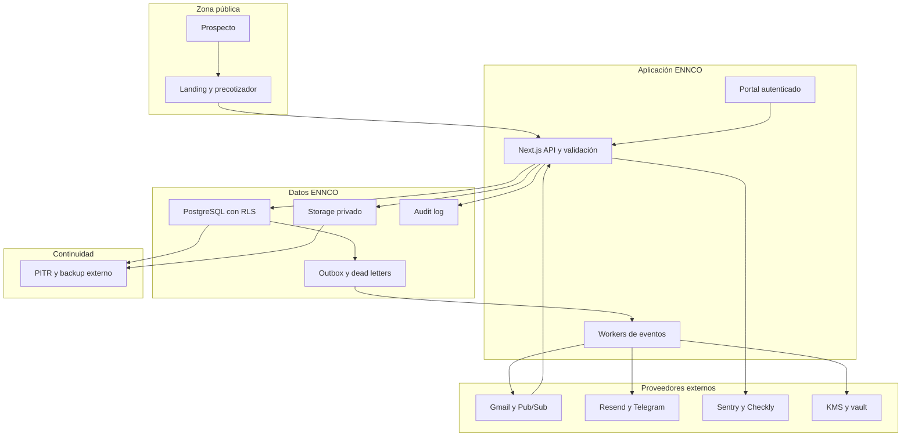

# Arquitectura M2

Snapshot: 11 de agosto de 2026, America/Mexico_City.

## Veredicto

Arquitectura local y contratos de seguridad: `EVIDENCE_READY`.

Gate M2 global: `EXTEND`.

No existe infraestructura ENNCO provisionada, integración completa de Supabase Auth y Storage, proveedor aprobado, DPA, región ni eliminación end-to-end. El backup lógico y restore de objetos sintéticos sí fueron probados localmente. Este documento no autoriza producción, staging compartido, cuentas, compras, DNS, credenciales o datos reales.

## Estados

- `VERIFIED`: código, migración o prueba local inspeccionable.
- `UNKNOWN`: no hay evidencia suficiente.
- `BLOCKED_EXTERNAL`: requiere proveedor, compra, credencial, DNS, revisión o aprobación externa.

## Arquitectura por zonas

Z1, el contrato relacional de Z2 y un drill local de Z4 existen con datos sintéticos. Auth y Storage administrados, proveedores y continuidad de producción son arquitectura objetivo.

## Componentes y evidencia

| Componente | Responsabilidad | Estado | Evidencia | Gap |
|---|---|---|---|---|
| Next.js, React y TypeScript | Landing, portal, API y gates de runtime | VERIFIED | `package.json`, `src/app`, `src/lib/runtime/config.ts` | Integración live no creada |
| Runtime fail closed | Demo en development, envío externo false y kill switch true | VERIFIED | `.env.example`; tests M1 | Secret manager y variables de producción bloqueados |
| PostgreSQL | Datos canónicos, constraints, funciones y auditoría | VERIFIED en PG16 local | `supabase/migrations/202608110001_core.sql`; `CORE_DATABASE_GATE_PASS` | Runtime Supabase PG17 no probado |
| Multi-tenancy | `organization_id`, integridad cruzada y RLS | VERIFIED en suite local | Migración y pruebas adversariales | Auth real y claims JWT no integrados |
| Supresión y envío | Consulta fail closed, idempotencia, locks y release gates | VERIFIED en suite local | `app.is_suppressed`, `app.enqueue_outbound_message` | Anexo A y proveedor de correo pendientes |
| Outbox y DLQ | Claim concurrente, retry, backoff, lease y dead letter | VERIFIED en suite local | Funciones `claim`, `complete`, `fail` y `requeue` | Worker administrado y canal real pendientes |
| Audit log | Append-only, allowlist y triggers de dominio | VERIFIED local | Migraciones 001 y 002; pruebas centinela | Revalidar en Supabase real y aplicar retención final |
| Supabase Auth | Sesión, MFA y membresía | VERIFIED en aplicación y política local; BLOCKED_EXTERNAL para proveedor | `src/lib/auth`, `src/lib/supabase`, tests | Proyecto, región, usuarios y MFA reales desconocidos |
| Supabase Storage | Recibos y PDFs privados | VERIFIED con stubs PostgreSQL; BLOCKED_EXTERNAL para proveedor | Migración 002 y `SECURE_STORAGE_GATE_PASS` | Antivirus real, signed URLs, proyecto y borrado real no probados |
| Gmail y Pub/Sub | Envío, respuestas, rebotes y bajas | BLOCKED_EXTERNAL | Contratos de datos y provider event existen | Dominios, cuentas, OAuth, KMS y webhook pendientes |
| Resend y Telegram | Notificaciones | BLOCKED_EXTERNAL | Outbox y delivery ledger existen | Cuenta ENNCO, DPA, región y destino pendientes |
| Sentry y Checkly | Error, trazas y sintéticos | BLOCKED_EXTERNAL | Variables vacías y BOM | Cuenta, DPA, región, scrub y retención pendientes |
| KMS y vault | Cifrado y custodia de secretos | BLOCKED_EXTERNAL | Arquitectura y BOM | Cuenta, región, llaves, rotación y offboarding pendientes |
| PITR y backup externo | RPO, RTO y recuperación | VERIFIED para restore lógico y replay parcial local; BLOCKED_EXTERNAL para producción | `evidence/m2-restore/summary.json`; `docs/evidence/M2-retention-live-local-gate-report.md` | PITR, journal externo autenticado, RPO 15m, RTO 4h y Storage real no probados |

## Flujo E2E y transacciones

### Captación

1. El navegador envía campos allowlist y archivo opcional.
2. La API valida tipos, tamaño, consentimiento, rate limit e idempotency key.
3. El servidor selecciona sólo un modelo `APPROVED` y vigente. Si no existe, falla cerrado.
4. La base guarda precotización, folio, correlation ID y resultado versionado.
5. Storage recibe el archivo privado con checksum y `retention_until`.
6. La transacción crea un evento de outbox.
7. El worker notifica sin incluir recibo o PII en el payload.

Estado live: `BLOCKED_EXTERNAL`. El flujo actual es sintético y no persiste datos reales.

### Outreach y respuesta

1. Una cuenta verificada se concilia contra Anexo A, clientes, bajas, rebotes y DNC.
2. `app.enqueue_outbound_message` toma lock y repite la supresión dentro de la transacción.
3. Dry run crea `message` y outbox sin proveedor.
4. Un envío real también exige runtime habilitado, kill switches abiertos, campaign manifest, canary PASS, autenticación de dominio, reputación, contacto verificado y secuencia aprobada.
5. Provider event entra con ID externo único, firma, timestamp y protección de replay.
6. Una respuesta sustantiva crea actividad, evidencia, lead y siguiente acción de forma atómica o entra en retry/cuarentena.

Estado dry run: `VERIFIED`. Estado real: `BLOCKED_EXTERNAL`.

## Autorización

| Rol | Lectura | Escritura | Restricción |
|---|---|---|---|
| `ennco_admin` | Datos ENNCO y gobierno | Operación y controles permitidos | No accede a secretos desde portal |
| `ennco_operator` | Datos ENNCO operativos | Leads, tareas y pipeline | No cambia controles técnicos críticos |
| `teckel_admin` | Datos ENNCO y controles técnicos | Configuración técnica autorizada | Producción sigue bajo gate de Jorge |
| `teckel_operator` | Operación técnica y colas | Procesa eventos autorizados | No aprueba release ni compra |
| `auditor_readonly` | Evidencia y datos permitidos | Ninguna | Sin export sensible por default |
| `service_role` | Sólo backend confiable | Funciones técnicas específicas | Nunca se expone al navegador |

La migración prueba RLS en PostgreSQL local. La aplicación verifica claims firmados, AAL2 y membresía, pero la integración con un proyecto Auth real permanece `UNKNOWN`.

## Ambientes

- Local: datos sintéticos, kill switch activo, external send false. `VERIFIED`.
- Staging aislado 0%: autorizado por AVA, todavía no provisionado. `UNKNOWN`.
- Producción: bloqueada. Requiere cuentas ENNCO, MFA, región, DPA, secretos, backups, restore, UAT, seguridad y aprobación explícita.
- No se copiarán datos reales de producción a local o staging. Los fixtures se sintetizan o anonimizan con evidencia.

## Seguridad y continuidad

- TLS en tránsito: requerido, no verificado en infraestructura inexistente.
- Cifrado en reposo: requerido, proveedor y llave `BLOCKED_EXTERNAL`.
- Tokens OAuth: KMS previsto, no existe llave.
- PII en logs: prohibida. Audit log usa allowlist local. Falta scrub real en observabilidad externa.
- Upload: magic bytes, tamaño, checksum, path opaco, Storage privado y cuarentena pasan localmente. Antivirus real no está conectado.
- Backup: restore lógico, restore de objetos y replay parcial del grafo sintético pasan localmente. No es un PITR real y no prueba un journal externo independiente. RPO de 15 minutos y RTO de cuatro horas no pueden declararse.
- Migraciones: PostgreSQL local validó core, Storage, rollback y reaplicación. Auth, Storage, PITR y restore integral en proveedor siguen pendientes.

## Evidencia exacta

- `docs/evidence/M1-gate-report.md`: M1 local sintético PASS y `CORE_DATABASE_GATE_PASS`.
- `supabase/migrations/202608110001_core.sql`: esquema core, RLS, integridad tenant, supresión, outbox, DLQ, audit log y roles.
- `supabase/migrations/202608110002_secure_document_storage.sql`: Storage privado, cuarentena y audit allowlist.
- `evidence/m2-restore/summary.json`: restore local separado con límites explícitos de producción.
- `docs/evidence/M2-retention-live-local-gate-report.md`: M021 PASS LOCAL para política, borrado integral, propagación fail closed y replay parcial.
- `docs/04-bill-of-materials.md`: todos los proveedores en `UNKNOWN` o `BLOCKED`, sin compra autorizada.
- `docs/10-data-processing-inventory.md`: finalidades, categorías, destinos y gaps legales.
- `docs/11-retention-policy.md`: defaults y controles locales de legal hold y eliminación verificados.
- `docs/runbooks/incident-response.md`: respuesta y escalamiento.

## Bloqueos para M2 PASS

1. Revalidar Auth, RLS, audit allowlist y Storage en proyecto aislado ENNCO.
2. Conectar antivirus real y signed URLs; magic bytes y cuarentena ya pasan localmente.
3. Revalidar M021 en Supabase aislado e integrar scheduler, ACK reales de proveedores y PITR administrado con journal externo autenticado. El control local sintético ya pasa.
4. Aprobar base legal, aviso de privacidad, DPA, región y subprocesadores.
5. Configurar PITR y backup de Storage, ejecutar restore y re-aplicar tombstones.
6. Rotar credenciales expuestas y custodiar secretos en vault aprobado.
7. Designar on-call, responsable de privacidad y canal de incidentes de producción.

Hasta entonces, M2 puede avanzar en local con datos sintéticos, pero no puede procesar información real ni declarar controles de producción.
