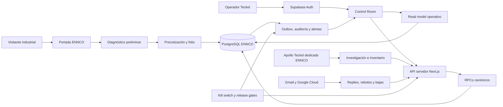

# ENNCO UX, UI y producto, handover maestro

Este documento permite continuar el diseño de ENNCO en Figma, Stitch, otra sesión de Codex, otro agente o directamente en código sin perder el contexto de producto, la identidad real, los controles operativos ni el trabajo ya realizado.

Es un handover de diseño y producto. No contiene contraseñas, llaves API, tokens, secretos de Vercel, secretos de Supabase ni códigos MFA. Esos valores deben permanecer en los vaults administrados y nunca copiarse a un archivo Markdown.

## 1. Objetivo del proyecto

ENNCO necesita un sistema comercial operativo que convierta investigación industrial en oportunidades reales, con evidencia y control. El objetivo no es construir otro CRM ni un dashboard decorativo.

El producto debe:

1. Presentar a ENNCO como una firma seria de ingeniería energética industrial.
2. Permitir que un prospecto obtenga una estimación preliminar entendible y deje información suficiente para una revisión técnica.
3. Mantener un inventario verificable de empresas y contactos industriales.
4. Aplicar supresión, bajas, privacidad y evidencia antes de cualquier acción comercial.
5. Procesar respuestas, leads, reuniones, oportunidades, pagos y atribución sin inflar métricas.
6. Mostrar a Teckel qué puede operar, qué está bloqueado y cuál es la siguiente acción.
7. Mantener cualquier envío externo en `HOLD` hasta que los gates live estén comprobados.

La north star contractual es el lead calificado con evidencia. Correos enviados, aperturas, contactos guardados, reuniones agendadas y respuestas genéricas no son equivalentes a un lead.

## 2. Qué es ENNCO

ENNCO es una empresa mexicana de ingeniería y operación energética industrial. La experiencia debe comunicar:

- Sistemas fotovoltaicos industriales.
- Ingeniería eléctrica.
- Almacenamiento de energía.
- Mantenimiento.
- Termografía y revisión técnica.
- Decisiones basadas en recibo CFE, condiciones de sitio, estructura, distancias, obra eléctrica y revisión comercial.

No debe sentirse como:

- Una empresa genérica de paneles solares residenciales.
- Una plantilla SaaS.
- Un dashboard de marketing.
- Una interfaz de inteligencia artificial genérica.
- Una colección de tarjetas equivalentes.
- Una promesa de ahorro o instalación definitiva sin revisión técnica.

## 3. Estado vivo verificado

Fecha de este corte: 25 de agosto de 2026, America/Mexico_City.

| Superficie | Estado observado |
|---|---|
| Producción | `https://ennco-operacion.vercel.app` |
| Control Room | `https://ennco-operacion.vercel.app/operacion` |
| Diagnóstico | `https://ennco-operacion.vercel.app/diagnostico` |
| Acceso | `https://ennco-operacion.vercel.app/ingreso` |
| Vercel project | `ennco-operacion` |
| Vercel project ID | `prj_La0jTQsknyvaZFNKZXNdZZkVwTA2` |
| Deployment productivo verificado | `dpl_2NPYqn5WByWzKPEFTUHb3vHxq61q` |
| Supabase project | `ennco-revenue-platform` |
| Supabase project ref | `isnzaoifdjtwnugupidj` |
| Branch local | `main` |
| Commit base del worktree | `f35c77a8140e954712432d0921ad76dabb1d8f06` |
| Remoto Git configurado | Ninguno en este checkout |
| Estado Git al crear este handover | 185 entradas, 87 tracked modificadas y 98 untracked |
| Envío externo | Bloqueado |
| Kill switch | Activo por diseño |
| Datos sintéticos como verdad live | Prohibido |

La URL productiva redirige correctamente `/operacion` a `/ingreso` cuando no existe sesión. La respuesta observada incluye CSP, HSTS, `X-Robots-Tag: noindex, nofollow, noarchive`, protección contra frames y una política de permisos restrictiva.

### Advertencia de continuidad

El código desplegado incluye trabajo que todavía no está consolidado en el commit base. No se debe clonar únicamente `f35c77a...` y asumir que contiene el diseño actual.

Antes de mover el diseño a otro equipo o computadora hay que:

1. Congelar el worktree actual.
2. Revisar y separar cambios por alcance.
3. Crear un commit o una rama de handover.
4. Configurar deliberadamente el remoto Git correcto.
5. Volver a desplegar desde ese commit y comparar contra producción.

No hacer `git reset --hard`, `git checkout -- .` ni limpieza masiva del worktree.

## 4. Arquitectura del producto



### Regla de autoridad

- PostgreSQL es la fuente de verdad comercial, de supresión, atribución y autorización.
- El Control Room es la vista operativa.
- Apollo es proveedor de investigación e infraestructura, no fuente canónica.
- Gmail aporta evidencia de mensajes y conversaciones.
- Vercel hospeda la aplicación.
- Supabase administra base, Auth y Storage.
- Teckel opera las cuentas de Vercel, Supabase y proveedores para ENNCO.

## 5. Arquitectura de experiencia

```mermaid
flowchart TD
    PUBLICO[Experiencia pública] --> HOME[/]
    PUBLICO --> DIAG[/diagnostico]
    PUBLICO --> PRIV[/privacidad]

    IDENTIDAD[Identidad privada] --> LOGIN[/ingreso]
    IDENTIDAD --> REC[/ingreso/recuperar]
    IDENTIDAD --> PASS[/ingreso/nueva-contrasena]
    IDENTIDAD --> MFA[/ingreso/mfa]

    CONTROL[Control Room] --> HOY[/operacion]
    CONTROL --> ALERTAS[Alertas e incidentes]
    CONTROL --> CAD[Cadencia]
    CONTROL --> INFRA[Infraestructura]
    CONTROL --> RESP[Respuestas]
    CONTROL --> LEADS[Leads]
    CONTROL --> EMP[Empresas]
    CONTROL --> PRE[Precotizaciones]
    CONTROL --> CAM[Campañas]
    CONTROL --> PIPE[Pipeline]
    CONTROL --> APR[Aprobaciones]
    CONTROL --> ROAD[Roadmap]
    CONTROL --> REP[Reportes]
    CONTROL --> EXP[Exportaciones]
    CONTROL --> ENT[Entrega]
```

La experiencia es deliberadamente dual:

- Público: marca, capacidades y diagnóstico.
- Privado: autenticación y operación.

Nunca mezclar navegación promocional extensa dentro del Control Room.

## 6. Dirección visual aprobada

Nombre de la dirección: `Ingeniería premium`.

Principios:

- Industrial, sobria, precisa y fotográfica.
- Mucha jerarquía, poco ornamento.
- Logo ENNCO oficial, nunca un icono improvisado.
- Navy y oro como identidad, no como degradado decorativo.
- Datos y estados con densidad enterprise.
- Bordes rectos o radios muy pequeños.
- Sombras contenidas.
- Color, icono y texto comunican juntos.
- `UNKNOWN` jamás se presenta en verde.
- Fondos generados sólo como atmósfera, nunca como evidencia de proyectos.

### Problemas visuales ya detectados y corregidos

1. El primer acceso usaba un símbolo de rayo provisional y texto `ENNCO`, no el logo real.
2. El Control Room tenía navegación horizontal en píldoras y se cortaba en pantalla.
3. La tipografía Barlow Condensed más Source Sans 3 se percibía como una plantilla repetida de IA.
4. El encabezado gigante competía con la información operativa.
5. Todas las métricas tenían el mismo peso visual en tarjetas equivalentes.
6. La interfaz no parecía un sistema privado de ingeniería.
7. El producto usaba suficientes elementos genéricos como para sentirse `vibecodeado`.

La corrección actual usa logo oficial, Aileron, navegación lateral navy, oro exacto, una consola de autorización, matrices continuas, tablas más densas y una jerarquía compacta.

## 7. Fuentes de marca y activos originales

### Fuentes externas recibidas

- Illustrator maestro: `/Users/Jorge/Downloads/Material Gráfico ENNCO 2/Ennco.ai`
- Copia equivalente: `/Users/Jorge/Downloads/Material Gráfico ENNCO/Ennco.ai`
- Portafolio oficial: `/Users/Jorge/Downloads/WhatsApp Chat - Paco Orozco/00000011-Portafolio ENNCO.pdf`
- Material fotográfico: `/Users/Jorge/Downloads/Material Gráfico ENNCO 2/`

### Activos optimizados dentro del repositorio

- `public/brand/ennco-lockup.svg`
- `public/brand/ennco-mark.svg`
- `public/media/ennco/industrial-rooftop.*`
- `public/media/ennco/solar-installation.*`
- `public/media/ennco/installation-team.*`
- `public/media/ennco/thermography.*`
- `public/media/generated/engineering-texture.*`
- `public/media/generated/thermal-field.*`
- `public/media/manifest.json`

`public/media/manifest.json` registra fuente, SHA256, crop, outputs, uso permitido y texto alternativo. Debe actualizarse si se agrega, sustituye o recorta un activo.

### Reglas de activos

- No redibujar el logo con IA.
- No alterar proporciones, rayo, wordmark ni tagline.
- No usar fotografías con placas, nombres de clientes o información identificable sin autorización.
- No afirmar ahorros, resultados, clientes o rendimiento a partir de una fotografía.
- Los recursos de ImageGen son fondos decorativos, nunca evidencia.
- Servir AVIF y WebP responsivos.
- Mantener lazy loading fuera del primer viewport.

## 8. Tipografía

La inspección del portafolio ENNCO identificó Aileron, Code Pro, Pangram y Glacial Indifference.

Implementación actual:

- Interfaz y titulares: Aileron.
- Datos, hashes, folios y estados técnicos: SF Mono, Roboto Mono o Consolas como fallback local.
- Paquete: `@fontsource/aileron@5.3.0`.
- Pesos cargados: 400, 600, 700 y 800.

Archivos:

- `src/app/layout.tsx`
- `src/styles/tokens.css`

No introducir Inter, Source Sans, Geist, Barlow, Poppins o una tipografía nueva por conveniencia. Code Pro fue observada en materiales, pero no se incluyó porque su uso web requiere resolver su licencia correspondiente.

## 9. Paleta y tokens

El sistema vive en `src/styles/tokens.css`.

| Token | Valor | Uso |
|---|---:|---|
| `--navy-1000` | `#061F3D` | Sidebar y consola ejecutiva |
| `--navy-950` | `#0A2D57` | Fondos y títulos de autoridad |
| `--navy-900` | `#183F75` | Identidad, navegación y acciones |
| `--navy-800` | `#0E4C88` | Interacción y foco secundario |
| `--gold-500` | `#EDB212` | Acento ENNCO y prioridad |
| `--ivory-100` | `#F4F0E7` | Superficies públicas |
| `--graphite-900` | `#172027` | Texto y fondos técnicos |
| `--copper-500` | `#B8663B` | Acento editorial controlado |
| `--success` | `#1D6D4B` | Estado comprobado |
| `--warning` | `#8B5A00` | Advertencia |
| `--danger` | `#A9382D` | Bloqueo o incidente |
| `--unknown` | `#6F586C` | Estado desconocido |
| `--canvas` | `#F4F6F8` | Canvas operativo |

Radios: 2, 4 y 8 px. No convertir el sistema a tarjetas redondeadas o glassmorphism.

## 10. Estructura frontend

### Núcleo de estilos

| Archivo | Responsabilidad |
|---|---|
| `src/app/globals.css` | Importa las capas del sistema visual |
| `src/styles/tokens.css` | Tipografía, color, radios, sombras y layout |
| `src/styles/base.css` | Reset, header, acciones, paneles y fundamentos |
| `src/styles/public.css` | Portada, diagnóstico, autenticación y privacidad |
| `src/styles/operations.css` | Control Room, sidebar, matrices, tablas y responsive |

### Shell y navegación

| Archivo | Responsabilidad |
|---|---|
| `src/components/SiteHeader.tsx` | Logo, contexto y acciones principales |
| `src/components/OperationsNav.tsx` | Navegación Control, Comercial y Gobierno |
| `src/app/operacion/layout.tsx` | Shell, sidebar, navegación móvil y footer |

### Superficies

| Archivo | Superficie |
|---|---|
| `src/app/page.tsx` | Portada pública |
| `src/app/diagnostico/page.tsx` | Diagnóstico y estimación |
| `src/components/PrequoteForm.tsx` | Flujo y resultado de precotización |
| `src/app/ingreso/page.tsx` | Acceso |
| `src/app/ingreso/mfa/page.tsx` | MFA |
| `src/app/operacion/page.tsx` | Hoy |
| `src/app/operacion/[module]/page.tsx` | Módulos operativos |
| `src/components/PortalTable.tsx` | Tablas y módulos |
| `src/components/OperationsActions.tsx` | Mutaciones permitidas |
| `src/components/PortalTableFilter.tsx` | Filtro de tablas |

### Datos del portal

No diseñar leyendo directamente tablas desde los componentes.

- `src/lib/operations/portal.ts` arma el read model del Control Room.
- `src/lib/operations/presentation.ts` transforma estados para la interfaz.
- `src/lib/operations/capacity.ts` valida capacidad.
- `src/lib/operations/cadence.ts` valida cadencia.
- `src/lib/research/portal.ts` valida inventario de investigación.
- `src/lib/infrastructure/` valida proveedor y carriles de outbound.
- `src/lib/supabase/` maneja clientes de Supabase.

El diseño puede reorganizar la presentación, pero no debe reinterpretar estados ni inferir autorización.

## 11. Anatomía del Control Room

### Navegación

Desktop:

- Header blanco con lockup ENNCO.
- Sidebar navy persistente.
- Tres grupos: Control, Comercial y Gobierno.
- Indicador oro para la ruta activa.

Móvil:

- Header compacto.
- Menú de operación en disclosure.
- Sin carrusel horizontal.
- Sin navegación cortada.

### Pantalla Hoy

Orden obligatorio:

1. Autorización efectiva, kill switch, frescura y evidencia.
2. Acción más urgente, responsable y vencimiento.
3. Leads, respuestas, reuniones y tareas.
4. Pipeline estricto, pagos y capacidad.
5. Infraestructura y gates técnicos.

El usuario debe entender en menos de diez segundos:

- Si el sistema puede operar.
- Qué lo bloquea.
- Qué acción sigue.
- Quién debe realizarla.
- Qué resultado comercial real existe.

### Estados

- `HEALTHY` o `PASS` sólo con evidencia válida.
- `UNKNOWN` se muestra bloqueado, nunca verde.
- `HOLD` no equivale a error técnico. Es una decisión efectiva de control.
- `synthetic_demo` debe estar identificado como sintético.
- `Datos reales` no implica autorización de envío.
- `Apollo ACTIVE` no implica `OUTREACH_READY`.

## 12. Diagnóstico y modelo de Paco

El diagnóstico entrega una estimación preliminar, nunca un precio contractual.

Parámetros congelados:

- Tarifa efectiva: MXN 2.80 a 3.35 por kWh.
- Producción mensual: 120 a 165 kWh por kWp.
- Módulos: 620 a 650 Wp.
- Superficie: 5.2 a 7.3 m² por kWp.
- Menores de 30 kWp: MXN 18,000 a 29,000 por kWp.
- Mayores de 30 kWp: MXN 17,000 a 24,000 por kWp.
- Proyectos de 100 kWp o más: validación técnica y comercial obligatoria.
- Garantía: 24 meses por vicios ocultos.
- Descuento de contado: 3% a 6%.
- Precio de arranque: MXN 11,000 por módulo instalado.
- Fecha de instalación: según materiales y programación de obra.

Archivos fuente:

- `data/prequote/model-approved-v3.json`
- `data/prequote/paco-approved-parameters-2026-08-20.json`
- `docs/27-paco-prequote-review-pack.md`
- `src/lib/domain/prequote.ts`
- `src/components/PrequoteForm.tsx`

No cambiar estos valores como parte de un rediseño.

## 13. Infraestructura y proveedores

### Custodia

Teckel administra las cuentas de Vercel y Supabase usadas por el sistema. El contrato está firmado y archivado. No hay operador suplente. La operación corresponde a Teckel.

### Apollo

La API disponible es la del workspace de Teckel, planeado como workspace dedicado para ENNCO.

Contrato de estado esperado:

- `custody_model: TECKEL_MANAGED_FOR_ENNCO`
- `workspace_mode: ENNCO_DEDICATED`
- `sender_identity: FRANCISCO_CUELLAR`
- `legacy_teckel_assets: ARCHIVED`
- `external_send_allowed: false`
- `global_kill_switch: true`

Referencias:

- `docs/30-apollo-contract-alignment.md`
- `docs/32-m24-provider-infrastructure.md`
- `supabase/migrations/202608250031_apollo_teckel_dedicated_ennco.sql`
- `src/lib/providers/apollo/`

Apollo sirve para investigación, inventario y lectura de infraestructura. No activa secuencias, no autoriza destinatarios y no sustituye PostgreSQL.

### Gmail y Google Cloud

El carril principal contempla `contacto@ennco.com.mx`, pero OAuth, KMS, Gmail API, Pub/Sub y DKIM live permanecen sujetos a acceso y configuración de Google.

Referencias:

- `docs/34-m30-gmail-oauth-kms-broker.md`
- `docs/evidence/M30-gmail-oauth-kms-gate-report.md`
- `src/lib/gmail/`
- `supabase/migrations/202608250030_gmail_oauth_kms_broker.sql`

### Anexo A

Las organizaciones a no contactar confirmadas son:

- POSCO MPPC.
- MPE PLASTIC.
- TEJAS EL ÁGUILA.

El sistema también conserva alias y dominios conocidos. No publicar el Anexo A crudo en Apollo.

Referencias:

- `data/suppression/`
- `docs/evidence/M0-anexo-a-reconciliation.json`
- `src/lib/suppression/`
- `supabase/migrations/202608200025_annex_a_transactional_suppression.sql`

## 14. Variables de entorno

La lista y documentación viven en `.env.example`.

Categorías:

- Aplicación pública: `NEXT_PUBLIC_APP_ENV`, `NEXT_PUBLIC_APP_URL`.
- Supabase: URL, publishable key y organization ID.
- Release gates: envío, kill switch, publicación, Gmail, assistant, unsubscribe, demo y MFA.
- Secretos HMAC: precotización, PDF, Gmail, OAuth y unsubscribe.
- Apollo: API key, perfil esperado, buzones esperados y cap de créditos.
- Google: proyecto, KMS, OAuth y Pub/Sub.
- Otros proveedores: Resend, Sentry y Telegram.

Reglas:

- Nunca escribir valores en este documento.
- Nunca exponer una llave como `NEXT_PUBLIC_*`.
- Nunca copiar secretos de producción a `.env.example`.
- Usar `vercel env ls` para inventario y los vaults para valores.
- El navegador no debe recibir `service_role`.

Variables productivas observadas en Vercel incluyen la configuración pública, Supabase, kill switch, OAuth Gmail, publicación, MFA, prequote y unsubscribe. El valor de cada una permanece deliberadamente fuera del handover.

## 15. Cómo levantar el proyecto

Requisitos:

- Node.js compatible con Next.js 16.
- npm.
- PostgreSQL local o el runner desechable para gates SQL.
- Playwright para E2E.
- Vercel CLI para inspección y despliegue.
- Supabase CLI para migraciones y proyecto administrado.

```bash
cd /Users/Jorge/dev/ennco-revenue-platform
npm install
cp .env.example .env.local
npm run dev
```

Abrir:

- `http://localhost:3000/`
- `http://localhost:3000/diagnostico`
- `http://localhost:3000/ingreso`
- `http://localhost:3000/operacion`

El demo sintético sólo se permite fuera de producción y con `ENNCO_DEMO_MODE=true`.

## 16. Verificación mínima para diseño

Antes de declarar un cambio de diseño listo:

```bash
npm run typecheck
npm run lint
npm run build
npm test -- --run src/lib/operations/presentation.test.ts src/lib/operations/portal.test.ts
npm run test:e2e
```

Gate visual M31:

```bash
node scripts/m31-ux-browser-gate.mjs --repo .
```

Evidencia:

- `evidence/m31-ux-redesign/README.md`
- `evidence/m31-ux-redesign/report.json`
- `evidence/m31-ux-redesign/checksums.sha256`
- `evidence/m31-ux-redesign/before/`
- `evidence/m31-ux-redesign/after/`

El rediseño M31 validó 20 capturas, cuatro viewports y cinco superficies sin overflow, CSP violations ni efectos externos. Después se aplicó la capa tipográfica y enterprise actual, se ejecutaron 190 pruebas E2E, build, lint y typecheck, y se comprobó en producción.

La nota M31 original todavía dice que no se había desplegado porque documenta el corte previo al despliegue. Este handover registra la verificación posterior y no debe confundirse con el alcance original del artefacto.

## 17. Flujo seguro para continuar el diseño en otro lado

### Paso 1. Congelar fuente

1. Duplicar el directorio o crear una rama desde el worktree consolidado.
2. Generar `git status --short` y guardar el resultado.
3. No descartar archivos untracked.
4. Confirmar qué commit produce la URL productiva.

### Paso 2. Extraer el kit de diseño

Entregar a la herramienta o diseñador:

- Este documento.
- `public/brand/`.
- `public/media/manifest.json`.
- Los assets optimizados usados por las superficies.
- `src/styles/tokens.css`.
- `src/styles/base.css`.
- `src/styles/public.css`.
- `src/styles/operations.css`.
- Capturas `before/` y `after/` de M31.
- Las rutas y estados definidos en este documento.

### Paso 3. Diseñar con datos coherentes

Usar fixtures que mantengan estas distinciones:

- Leads nuevos.
- Respuestas pendientes.
- Reuniones.
- Tareas.
- Pipeline estricto.
- Proyectos ganados.
- Primeros pagos.
- Autorización efectiva.
- Kill switch.
- Reply sync.
- Infraestructura Apollo y Gmail.

No poblar una pantalla con métricas arbitrarias sólo para que se vea llena.

### Paso 4. Implementar de afuera hacia adentro

Orden recomendado:

1. Tokens y tipografía.
2. Header y navegación.
3. Shell del Control Room.
4. Hoy.
5. Tablas y estados.
6. Módulos.
7. Diagnóstico.
8. Acceso.
9. Portada.
10. Responsive, teclado, motion y performance.

### Paso 5. Preservar contratos

El diseñador puede modificar:

- Markup de presentación.
- Composición visual.
- CSS.
- Componentes puramente visuales.
- Copy explicativo que no cambie obligaciones.

No puede modificar como parte del diseño:

- APIs.
- Migraciones.
- RPCs.
- RLS.
- Supresión.
- Kill switch.
- Autorización efectiva.
- Cálculos de precotización.
- Definiciones de lead, pipeline, revenue o capacidad.
- Lógica de Apollo o Gmail.
- Reglas de privacidad.

## 18. Prompt base para otro diseñador o agente

```text
Rediseña la experiencia ENNCO como un sistema enterprise de ingeniería energética industrial.

Usa únicamente el logo oficial y los activos del repositorio. La tipografía principal es Aileron. La paleta usa navy ENNCO #061F3D, #0A2D57 y #183F75, con oro #EDB212, marfil #F4F0E7 y grafito #172027. No uses Inter, Geist, Poppins, Barlow, glassmorphism, degradados SaaS, píldoras excesivas ni una cuadrícula de tarjetas equivalentes.

La experiencia tiene tres mundos: público, identidad y Control Room privado. En el Control Room, la autorización efectiva y la siguiente acción tienen mayor jerarquía que las métricas. UNKNOWN nunca es verde. Apollo activo no implica autorización. Datos reales no implican envío habilitado.

Preserva todos los contratos de datos, seguridad, supresión, kill switch, precotización y operaciones. Trabaja solamente en presentación y componentes visuales. Entrega desktop 1440 y 1280, tablet 768 y móvil 390, además de estados vacío, loading, error, unknown, blocked y ready.

La interfaz debe sentirse propia de ENNCO: sobria, industrial, fotográfica, precisa y operable. No debe parecer un template SaaS ni un sitio generado por IA.
```

## 19. Criterios de aceptación visual

- El logo ENNCO se reconoce de inmediato.
- La tipografía coincide con la identidad ya aprobada.
- Un operador detecta autorización y siguiente acción en menos de diez segundos.
- La navegación no se corta en desktop ni móvil.
- No existe scroll horizontal global a 320 px.
- Los objetivos táctiles principales miden al menos 44 px.
- El foco es visible.
- La navegación completa funciona por teclado.
- `prefers-reduced-motion` reduce movimiento.
- Texto y controles cumplen WCAG AA.
- No hay violaciones CSP.
- No hay requests externos inesperados.
- LCP móvil menor a 2.5 segundos.
- CLS menor a 0.1.
- Las imágenes originales pesadas no llegan al navegador.
- Los estados sintéticos, reales, unknown y blocked son inequívocos.
- El diseño no habilita publicación ni envío.

## 20. Estado funcional que el diseño debe reflejar

### Ya existe

- Portal productivo autenticado.
- Supabase administrado enlazado.
- Control Room con navegación por módulos.
- Diagnóstico y precotización preliminar.
- Modelo de Paco congelado.
- Supresión HMAC y Anexo A modelado.
- Leads estrictos, evidencia y pipeline contractual.
- Reuniones, pagos, atribución y capacidad operativa.
- Research Workbench 75/150 local.
- Inventario objetivo 150/300 modelado.
- Gmail OAuth y KMS modelados.
- Apollo read-only y contrato dedicado modelados.
- Kill switch, outbox, retries, DLQ, alertas y cadencia.
- Retención, borrado, replay y restore local.
- Seguridad, CSP, accesibilidad y performance local.

### Todavía no equivale a live completo

- Reconversión final del workspace Apollo.
- Compra live de dominios y buzones.
- Gmail OAuth live del buzón principal.
- DKIM y seeds comprobados.
- Inventario productivo completo.
- Reply sync live.
- Warmup real de 42 días.
- Primer manifiesto aprobado.
- Primer canary observado.
- UAT y aceptación final.

El programa permanece `EXTEND`. Envíos externos siguen bloqueados.

## 21. Hallazgos y decisiones que no deben perderse

1. El contrato está firmado y archivado. No volver a pedirlo como pendiente general.
2. No existe operador suplente. Teckel opera el sistema.
3. Vercel y Supabase se manejan con cuentas de Teckel.
4. La API de Apollo disponible es la de Teckel.
5. El plan actual contempla dedicar ese workspace a ENNCO y archivar la operación Teckel anterior.
6. `contacto@ennco.com.mx` es el buzón principal previsto.
7. Francisco Cuellar es la identidad visible prevista.
8. El horario operativo informado es 07:00 a 20:00.
9. El Anexo A está reducido a tres empresas y sus identidades conocidas.
10. Los parámetros técnicos de Paco ya fueron recibidos y congelados.
11. Resend es para mensajes transaccionales y alertas, no cold outbound.
12. Apollo no es fuente de verdad comercial.
13. Un proveedor activo no autoriza un envío.
14. No se comparte una contraseña dentro de documentación o Git.
15. El principal aprendizaje de D'Group fue que el seguimiento y la velocidad de respuesta importan tanto como la entrega.
16. Los dominios nuevos necesitan warmup real antes de prospectos.
17. El dominio principal sólo puede considerarse para un canary Tier 1 muy limitado y con evidencia completa.
18. No hay que confundir inventario con campaña.
19. El diseño anterior falló porque usó identidad genérica y componentes visuales repetidos.
20. El diseño actual debe evolucionar sin volver a patrones de IA genérica.

## 22. Próximo sprint de diseño recomendado

1. Consolidar y commitear el worktree actual sin perder cambios.
2. Crear un remote Git explícito y registrar la URL en este handover.
3. Producir un archivo Figma con librería de tokens, header, sidebar, status, tablas, campos y panels.
4. Rediseñar Hoy con información progresiva y menos densidad inicial.
5. Diseñar estados completos de Apollo, Gmail, warmup e inventario.
6. Revisar todas las tablas con datos reales, strings largos, números grandes y estados parciales.
7. Hacer revisión visual humana en Safari y dispositivo físico.
8. Revisar contraste, orden de lectura del PDF y lector de pantalla.
9. Volver a correr M31 y E2E.
10. Desplegar preview, comparar y obtener aprobación explícita antes de promover.

## 23. Checklist de entrega a otro equipo

- [ ] Recibió este documento.
- [ ] Recibió acceso autorizado al repositorio o snapshot del worktree actual.
- [ ] Recibió `public/brand/` y `public/media/manifest.json`.
- [ ] Recibió capturas before y after de M31.
- [ ] Entiende que el repo local no tiene remoto configurado.
- [ ] Entiende que el worktree no está limpio.
- [ ] No recibió secretos en archivos o mensajes de diseño.
- [ ] Entiende las diferencias entre live, local, synthetic, unknown y blocked.
- [ ] Acepta no cambiar reglas comerciales o de seguridad.
- [ ] Entrega componentes y estados responsive.
- [ ] Pasa lint, typecheck, build, unitarias y E2E.
- [ ] Produce preview antes de producción.
- [ ] Obtiene aprobación explícita para promover.

## 24. Contactos y autoridad

- Operación técnica y proveedores: Teckel AI.
- Identidad comercial de envío prevista: Francisco Cuellar.
- Validación comercial y técnica de ENNCO: Paco Orozco.
- Contrato: firmado y archivado.

No guardar datos de acceso en esta sección.

## 25. Referencias prioritarias

- `README.md`
- `docs/00-program-charter.md`
- `docs/01-requirements-traceability.csv`
- `docs/03-risk-register.md`
- `docs/09-decision-register.md`
- `docs/14-m4-operations-architecture.md`
- `docs/22-capacity-and-research-workbench.md`
- `docs/29-activation-baseline-and-sender-options.md`
- `docs/30-apollo-contract-alignment.md`
- `docs/32-m24-provider-infrastructure.md`
- `docs/33-m29-hybrid-accelerated-outbound.md`
- `docs/34-m30-gmail-oauth-kms-broker.md`
- `public/media/manifest.json`
- `evidence/m31-ux-redesign/`

## 26. Definición de handover correcto

El handover está completo cuando otra persona puede:

1. Identificar el objetivo real del producto.
2. Abrir el sistema localmente.
3. Encontrar logo, tipografía, colores, fotos y evidencia.
4. Entender la navegación y el modelo de estados.
5. Rediseñar sin romper lógica ni seguridad.
6. Ejecutar los gates mínimos.
7. Generar una preview verificable.
8. Explicar con honestidad qué está live, qué es local y qué sigue bloqueado.

